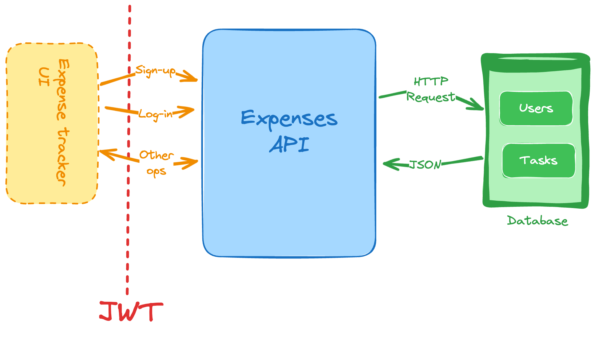

# Expense Tracker API

Expense Tracker API project from https://roadmap.sh/projects/expense-tracker-api
## Introduction

This is a RESTful API for an expense tracker application. It allows users to manage their expenses by providing endpoints for creating, retrieving, updating, and deleting expenses. The API is built using Spring Boot and uses JWT for authentication.



## Technologies Used

- Java 17
- Spring Boot 3.3.3
- Spring Security 3.3.3
- Spring Data JPA 3.3.3
- MySQL 9.0.0
- JWT 0.11.5
- Lombok 1.18.34

## Database Setup

1. Create a MySQL database named `expense_tracker`.
2. Update the database connection details in the `application.properties` file.

## Running the Application

1. Build the application using Maven: `mvn clean install`
2. Run the application: `mvn spring-boot:run`

## API Endpoints

**Authentication**

- **POST /api/auth/register:** Register a new user.
- **POST /api/auth/login:** Login an existing user.

**Expenses**

- **POST /expenses:** Create a new expense.
- **GET /expenses:** Get all expenses for the authenticated user.
- **GET /expenses/{id}:** Get an expense by ID.
- **PUT /expenses/{id}:** Update an expense by ID.
- **DELETE /expenses/{id}:** Delete an expense by ID.

## Authentication

The API uses JWT for authentication. After a successful login, a JWT token is returned in the response header. This token should be included in the `Authorization` header for all subsequent requests to protected endpoints.

## Example Usage

**Creating an Expense**
```bash
POST /expenses Authorization: Bearer <JWT_TOKEN>
{ "amount": 100.00, "description": "Grocery shopping", "category": "Food" }
```

**Getting All Expenses**
```bash
GET /expenses Authorization: Bearer <JWT_TOKEN>

```

## Contributing

Contributions are welcome! Please feel free to submit pull requests for any bug fixes, improvements, or new features.

## License

This project is licensed under the MIT License.
